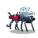

# OmaFly (Experimental Version)

<p align="center">
  
</p>

An experimental desktop pet fly for Omarchy/Hyprland, featuring 2D pixel art and behavioral decisions driven by a neural network incorporating circuits from FlyWire. The implementation prioritizes low power consumption; the small circuit runs on a compiled native CPU core, with a validated comparative proof on the GPU.

## Current Status
The project is currently in the feasibility prototype phase (V0.2).
- **What's working:** An escape and exploration prototype (with a functional neural network), a visual interface in PySide6/QML, a system tray icon control, and an optimized C++ core (low CPU impact). There is also a functional proof-of-concept for visual occlusion (hiding behind windows).
- **What's missing:** The full catalog of 10 behavioral responses, integration of shelter detection into the fly's neural decisions, and automatic installation/packaging as a native plugin for Omarchy.

## Future Vision
The plan for the release version (M3/V1.0) involves testing and integrating all 10 responses simultaneously. Post-V1, there are planned expansions (P2) that include new responses to visual threats and virtual CO2, precise traceability with the database (BANC/FlyWire), and an improved system for neural persistence between startups.

To prepare and run from checkout:

```sh
python tools/build.py
python tools/build_assets.py
python tools/extract.py
./run.sh run
```

The command opens only the tray icon; turn on the fly via the menu or with `./run.sh enable`. `./run.sh disable` suspends the simulation and removes the overlay; `./run.sh quit` terminates the instance. See [execution, tests, and limits](docs/IMPLEMENTATION.md).

| Document | Usage |
|---|---|
| [PRD](docs/PRD.md) | Experience, requirements, ten behavioral responses, and product priorities. |
| [Technical Spec](docs/SPEC.md) | Proposed architecture, contracts, and feasibility proofs; `/to-spec` delivery. |
| [TODO and Tickets](docs/TODO.md) | Ordered work, dependencies, and acceptance criteria; `/to-tickets` delivery. |
| [Evidence and Limits](docs/RESEARCH.md) | Local inspection, consulted sources, and unconfirmed questions. |
| [Implementation](docs/IMPLEMENTATION.md) | How to run, resource consumption limits, and what is still missing. |

The `/to-spec` and `/to-tickets` commands were interpreted as local document deliverables. No tickets were published to an external service.
