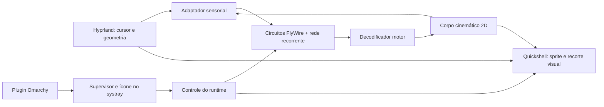

# Especificação técnica do FruitFly

Entrega de `/to-spec`, versão 0.1, de 14 de setembro de 2026. Implementa o escopo do [PRD](PRD.md); as escolhas de bibliotecas e frequências são propostas a validar em M0.

**Decisão posterior de baixo consumo:** o protótipo usa um núcleo C++/ctypes na CPU, com teste HIP separado. Não carrega bibliotecas de GPU ou treinamento no runtime. As seções de GPU abaixo descrevem a expansão proposta; a implementação atual está documentada em [IMPLEMENTATION.md](IMPLEMENTATION.md) e prioriza F14. O worker adota limite operacional de CPU, enquanto a interface só desenha mudanças do sprite.

## Arquitetura proposta

O aplicativo terá um supervisor com o ícone de bandeja, um processo de simulação e uma interface Quickshell independente. O plugin Omarchy será um ponto de integração para iniciar e controlar a instância. O processamento neural não ocorrerá no processo que mantém a barra do desktop.



| Componente | Escolha inicial | Responsabilidade |
|---|---|---|
| Supervisor e tray | Python/PySide6, `QSystemTrayIcon` | Publicar o item, controlar processos, manter estado ligado/desligado e receber CLI. |
| Cérebro | Worker C++/ctypes na CPU; aceleração opcional após benchmark | Atualizar circuito com custo limitado e comparar com backend GPU. |
| Referência e corpo | Python, biblioteca padrão; NumPy opcional para pesquisa | Validar resultados, integrar movimento e oferecer replay sem interface gráfica. |
| Overlay | Quickshell/QML | Desenhar pixel art, aplicar recorte visual e deixar o input atravessar. |
| Desktop | Adaptador Hyprland IPC | Coletar cursor, monitores e geometria com consultas limitadas. |
| Integração Omarchy | Plugin de usuário com manifesto | Iniciar/controlar instância e oferecer acesso ao estado. |
| Preparação do modelo | Ferramentas offline | Extrair conexões, calibrar ou treinar módulos e exportar pacote versionado. |

PySide6 e NumPy estão disponíveis no Python local. Brian2 e PyTorch não foram encontrados. A tarefa P0 deve validar um ambiente GPU compatível e manter NumPy como referência de correção. Não instalar dependências globais para resolver incompatibilidades de treinamento. [Inspeção local](RESEARCH.md)

## Execução na GPU

O hardware identificado é AMD Navi 33 (`gfx1102`), com aproximadamente 8 GiB de VRAM e `rocm-hip-runtime` 7.2.4 instalado. O teste FF-033 precisa conferir suporte da versão escolhida ao alvo, aos operadores usados e ao sistema. Instalação de ROCm não comprova compatibilidade funcional do PyTorch nem desempenho do circuito. [S12](RESEARCH.md)

A primeira rota de avaliação é PyTorch com ROCm/HIP, em ambiente isolado, para calibração e inferência. O backend reutiliza a interface `torch.cuda` mesmo em AMD; o nome da API não é evidência de execução em NVIDIA. Se essa rota não funcionar no hardware local, avaliar um worker de Vulkan compute para inferência. Essa alternativa exige kernels próprios e exportação dos parâmetros; não substitui automaticamente a ferramenta de treinamento. [S12 e S13](RESEARCH.md)

Manter conectividade esparsa, potenciais, atrasos, estados recorrentes e pesos na GPU. Transferir apenas o vetor sensorial por ciclo e comandos motores compactos na volta. Agrupar subpassos reduz lançamentos, mas o lote temporal deve respeitar a latência de reação e a necessidade de feedback corporal. Não copiar potenciais de todos os neurônios a cada quadro para alimentar a UI.

Testar atualização por neurônio pós-sináptico com conectividade de entrada agrupada, evitando depender inicialmente de somas atômicas não determinísticas. Comparar com a referência CPU em cenários determinísticos e com tolerâncias explícitas. Redes recorrentes adicionais podem usar operações densas pequenas; o benchmark decide se precisam ser agrupadas num kernel ou permanecer em um grafo de operações.

Separar benchmark do kernel, transferências, sincronização e latência completa. Fazer aquecimento antes de medir; chamadas assíncronas não podem ser cronometradas apenas pelo tempo de enfileiramento. CPU e GPU compartilham os mesmos cenários. Medir VRAM adicional, consumo em repouso e estabilidade do compositor sob carga gráfica. [S14](RESEARCH.md)

Ao desligar, parar lançamentos e consultas, guardar o estado neural em RAM se necessário e liberar arrays de GPU. Registrar separadamente a memória que o contexto do backend retiver; encerrar libera o worker inteiro. Se a GPU falhar, o supervisor mantém o tray e pausa o pet, sem migrar silenciosamente para outra dinâmica. O modo CPU fica disponível por configuração explícita para diagnóstico.

O `SystemTray` do Quickshell representa itens da bandeja; publicar o ícone próprio será responsabilidade do supervisor. O Qt documenta publicação em ambientes Linux com StatusNotifierItem. O funcionamento com o host instalado precisa ser demonstrado, inclusive após reiniciar a barra. [S9](RESEARCH.md)

## Contrato de decisão neural

A rede possui dois conjuntos identificáveis de parâmetros. O conjunto biológico mantém IDs e arestas extraídas do FlyWire, com hipóteses explícitas para dinâmica e eficácia sináptica. O conjunto construído mantém neurônios recorrentes e projeções projetadas ou treinadas para completar a política do desktop. Conexões novas entre os conjuntos recebem origem `engineered` ou `trained`.

A primeira hipótese é um núcleo LIF esparso para o circuito de fuga e uma rede recorrente de taxas para memória, seleção e controle contínuo. A composição continua sendo neural; não exige que toda célula use o mesmo modelo de spikes. A viabilidade de ajustar essa composição é uma questão de FF-006. O FlyVis oferece um precedente para ajustar parâmetros desconhecidos por tarefa, sem validar esta arquitetura específica. [S2](RESEARCH.md)

Entradas sensoriais podem conter distância e movimento relativo, mas não um rótulo calculado de ação recomendada. As saídas devem incluir avanço/recuo, giro e comandos de voo, pouso, limpeza e abrigo. Um decodificador fixo converte atividade em unidades do corpo; ele não recebe posição do cursor ou histórico do desktop. Competição entre ações incompatíveis acontece na rede.

Permitem-se limiares e histerese no decodificador para traduzir atividade contínua em acionamento de um atuador. Esses limiares não podem consultar ameaças, selecionar alvos ou impor um tempo de esconderijo. O corpo pode concluir uma fase motora de duração limitada, como um passo, e recusar um comando fisicamente impossível, devolvendo feedback. Uma animação longa não pode bloquear nova fuga comandada pela rede.

## Sensores e mundo virtual

O mundo usa coordenadas lógicas globais do compositor. O corpo mantém posição nesse mundo; o adaptador converte medidas para o referencial da mosca antes de entregá-las à rede. Posições negativas e escalas distintas são casos obrigatórios de teste.

| Entrada | Conteúdo | Limite de interpretação |
|---|---|---|
| Cursor | Direção, distância, tamanho angular virtual, expansão aparente e velocidade relativa filtrada. | Aproximação visual sintética; não são fotorreceptores completos. |
| Geometria | Distâncias direcionais a bordas, contato e entradas de abrigo elegíveis. | Representa um mundo virtual construído sobre a geometria do desktop. |
| Corpo | Velocidade, orientação, elevação, contato e esforço acumulado. | Feedback calculado pela cinemática simplificada. |
| Antenas | Irritação virtual que cresce/decai por uma equação ambiental versionada. | Estímulo de produto para testar grooming. |
| Visibilidade | Exposição ao cursor e visibilidade das bordas segundo a geometria virtual. | Sem leitura de pixels ou conteúdo textual dos aplicativos. |

A função que calcula expansão aparente precisa definir raio virtual do cursor, campo visual e conversão para corrente/taxa neural. O movimento de um ponteiro numa tela não produz automaticamente a mesma visão de um objeto físico se aproximando. Mapear posições anatômicas para campos receptivos é trabalho separado; se usarmos uma organização sintética, ela deve constar do manifesto.

A exposição ao cursor diminui atrás do abrigo conforme as regras do mundo virtual, mesmo que o processo ainda conheça a posição global do ponteiro. Isso permite que a rede experimente abrigo e reaparecimento pelo feedback recebido.

As janelas expostas são travessáveis no plano de voo sobre o desktop. Bordas só atuam como contato quando o modo físico e a superfície correspondente forem compatíveis. O limite do monitor é uma fronteira do mundo: saturação de posição impede perda da mosca, mas o teste de R03 deve mostrar giro neural antes de essa proteção atuar.

## Coleta do desktop

Usar snapshots de `cursorpos`, `clients` e `monitors`, com cache e identificadores estáveis durante a sessão. Eventos do socket de notificações invalidam o cache. Eles não substituem todas as atualizações de cursor e geometria: por exemplo, `movewindow` documenta mudança de workspace, não um fluxo contínuo de arraste. [S10](RESEARCH.md)

A proposta inicial é testar cursor a 30 Hz e 60 Hz, geometria de janelas a 5 Hz e 15 Hz durante mudanças e renderização a 30/60 Hz. São pontos de medição, não frequências aprovadas. Não abrir um subprocesso `hyprctl` por quadro na versão final sem justificar o custo; preferir IPC direto quando a prova confirmar o contrato disponível. Conexão direta não elimina o custo síncrono do compositor. [S6](RESEARCH.md)

Usar o snapshot mais recente com timestamp monotônico. Não acumular uma fila de posições antigas. Se a observação ficar obsoleta por mais de 250 ms, o supervisor pausa a simulação e sinaliza estado indisponível; esse limite operacional proposto será aferido em FF-007. Ao desligar, cessam consultas e inscrições que provoquem processamento contínuo de geometria.

## Preparação dos dados

Começar por `fafb-consolidated_cell_types.csv.gz`, `fafb-classification.csv.gz`, `fafb-neurons.csv.gz` e `fafb-connections_princeton.csv.gz`. A inspeção confirmou arestas agregadas de LC4/LPLC2 para descendentes candidatos, mas não produziu um circuito funcional completo. A auditoria deve registrar procedência, versão, limiares de publicação e licença de cada arquivo antes de redistribuir um pacote derivado.

Ler `root_id`, `pre_root_id` e `post_root_id` como strings em JSON/QML: os identificadores excedem a precisão inteira de `Number` em JavaScript. Gerar índices inteiros densos somente para o cálculo interno. Deduplicar anotações por ID com regras explícitas para conflitos, preservando o registro original.

As linhas de conexão podem separar o mesmo par por neuropil. A extração agrupa somente conforme a semântica escolhida e preserva a contribuição original. `syn_count` é uma contagem; transformá-la em eficácia elétrica exige ganho, sinal e hipótese de dinâmica. A previsão de neurotransmissor tem confiança e não determina todos os efeitos pós-sinápticos. Baixa confiança, modulação e sinapses elétricas não cobertas precisam aparecer como limitações do modelo. [S1](RESEARCH.md)

Manter lateralidade e posição celular quando forem relevantes para R01. Não reduzir tudo a uma soma por tipo celular. O tamanho do subgrafo será escolhido por função, cobertura e benchmark; não há meta arbitrária de 50–200 neurônios nem extração dos 13 GB de esqueletos como pré-requisito.

Exportar um pacote com arrays esparsos de conectividade e um manifesto contendo: hashes dos arquivos usados, versão do extrator, IDs originais, critérios de seleção, contagens e descartes, hipóteses de neurotransmissão, constantes temporais, sementes e procedência dos parâmetros. Os arquivos BANC/MANC/MAOL/MCNS permanecem separados até haver uma auditoria de compatibilidade.

## Dinâmica, calibração e aprendizado

Testar passo neural fixo entre 0,5 ms e 1 ms como ponto de partida para LIF, verificando estabilidade e sensibilidade à redução do passo. O relógio neural é independente do desenho; uma atualização de interface pode receber o resultado de vários passos. A taxa da rede de controle e a integração do corpo são medidas separadamente.

Para completar R01–R10, construir uma arena de treinamento e avaliação que gere as mesmas observações do desktop. Começar com calibração de uma rede recorrente pequena; se ela não alcançar o repertório, ajustar parâmetros offline com otimização por tarefas. A biblioteca de treinamento é uma decisão de FF-006/FF-011, preservando a possibilidade de exportar inferência leve.

O treinamento deve separar trajetórias, arranjos de janela e sementes entre treino e avaliação. A função de custo pode considerar contato com ameaça, gasto de movimento, exploração, pouso e recuperação. Esses objetivos são escolhas de produto e precisam ser publicados junto do modelo. Durante a inferência, apenas a rede escolhe ações; demonstradores com regras, se usados para comparação ou ensino, ficam fora do runtime de produção.

Evitar um caminho de entrada que torne o circuito FlyWire irrelevante. A prova mínima é que intervir no circuito altere de forma reproduzível a resposta de fuga dentro da política completa. Não basta remover toda a rede e observar que nada funciona. Preservar uma execução com ablação seletiva, uma com perturbação de pesos e controles de escala comparáveis.

## Corpo, animação e profundidade

O estado corporal contém `x`, `y`, orientação, velocidade, velocidade angular, elevação, contato, esforço e referência da superfície/abrigo. O corpo aplica amortecimento e limites de aceleração definidos no pacote de configuração. Forças e colisões atualizam o feedback, sem consultar uma tabela de comportamentos.

O atlas da mosca define quadros de repouso, passos, asas, pouso e limpeza. O renderizador escolhe quadros a partir da fase motora e dos comandos já decididos, preservando a perspectiva frontolateral. Contato e elevação governam a posição da sombra; não será necessário modelo 3D.

O abrigo usa uma seleção neural de candidato e um comando de entrar/sair. Candidatos são indexados de modo estável enquanto existirem; a rede recebe disponibilidade e geometria relativas, sem ordenação por “melhor fuga”. O corpo só estabelece a relação com uma janela ao cruzar uma entrada geometricamente válida, obedecendo ao comando. Isso evita sumir no centro de uma janela por mudança instantânea de visibilidade.

No interior, a posição pode ser armazenada relativa à janela-abrigo para acompanhá-la durante arraste, segundo uma restrição mecânica explícita. Fechar a janela ou removê-la do workspace rompe a relação e revela a mosca na última posição global válida; a rede recebe a mudança. Nenhum evento de janela ordena uma nova fuga.

O recorte visual do sprite pela janela é calculado no desenho (geometria, clipping ou shader a escolher em FF-004). `mask: Region {}` permanece responsável apenas pelo input. Uma instância de `PanelWindow` por monitor pode manter um fundo transparente, sem foco ou zona exclusiva, na camada overlay. A mosca é uma só; quando cruza monitores, o recorte de cada saída desenha apenas sua parte. [S7 e S8](RESEARCH.md)

Para a versão 1, a oclusão considera a janela-abrigo selecionada. Pilhas complexas e transparência por pixel exigem uma evolução. Se uma janela entrar na frente do abrigo, a regra conservadora é manter o sprite oculto na região do abrigo até receber geometria confiável; o caso precisa constar da matriz de testes.

### Recorte implementado em 15/09/2026

A sobreposição utiliza a adaptação `software` do Qt Quick por padrão, sem mudar o compositor. `FRUITFLY_RENDERER=rhi` permite uma comparação ou diagnóstico após encerrar a instância. A escolha aparece na telemetria como `renderer`; somente `software` e `rhi` são aceitos. Não há fallback automático para aceleração gráfica. [Evidência da escolha](../reports/RENDER-POWER.md).

O runtime usa até oito janelas por monitor/workspace e quatro entradas por janela, com dimensões mínimas de 128 × 128 pixels e espaço alcançável dos dois lados. A rede recorrente de abrigo está em `shelter_network.py`; o contato geométrico em `shelter.py`. Os campos `shelter`, `enter` e `exit` ampliam o comando motor. O sprite só assume o abrigo ao cruzar sua borda frontal de 32 pixels com ativação de entrada acima de 0,5. A posição acompanha a translação da janela; remover sua entrada encerra o contato.

A referência é retangular, sem resolver transparência ou pilhas arbitrárias. O cache agrega eventos do socket2, faz atualização de segurança a cada dois segundos e limita acompanhamento/mudanças a cinco snapshots por segundo. Cada snapshot lê janelas e monitores. `FrameGate` limita caminhada a 10 Hz e voo a 25 Hz, com prioridade para mudanças de visibilidade e fase motora, preservando a frequência neural. Ocultação total retira a superfície visível e suspende snapshots repetidos. A supervisão recebe telemetria aproximadamente uma vez por segundo, inclusive em repouso.

Esta implementação inicial não fecha os demais contratos propostos de treino, dez respostas, aceleração corporal, passagem entre monitores e validação energética. Evidências em [NEURAL-SHELTER.md](../reports/NEURAL-SHELTER.md).

## Contratos de execução e IPC

Usar socket Unix dentro de `$XDG_RUNTIME_DIR`, mensagens versionadas e limitadas em tamanho. O supervisor possui a instância; execuções adicionais enviam comando para ela. Controle tem prioridade sobre telemetria. A simulação deve continuar testável como biblioteca sem D-Bus, Quickshell ou sessão gráfica.

| Mensagem | Campos mínimos propostos | Regra |
|---|---|---|
| `Observation` | versão, sequência, timestamp, monitores, cursor relativo, campos geométricos e feedback | Apenas medidas, validade e unidades definidas. |
| `MotorCommand` | sequência, tempo neural, avanço, giro, voo, pouso, grooming, seleção e acionamento de abrigo | Produzida pelo decodificador neural. |
| `BodySnapshot` | sequência, posição, orientação, elevação, fase motora, ID de abrigo e recorte | UI lê snapshots; não integra uma segunda física. |
| `Control` | request ID, `enable`, `disable`, `status`, `quit` | Idempotente; responde com estado confirmado. |
| `Health` | estado do worker, atraso, tempo por passo, modelo e erro resumido | Supervisor detecta falhas sem depender da resposta do cérebro. |

Snapshots de desenho usam a política “mais recente vence”. Após falha ou atraso, não reproduzir em velocidade acelerada o tempo perdido. O supervisor oculta o overlay e pausa ou reinicia o worker conforme estado operacional; a ocorrência é registrada e o tray continua acessível.

## Estados do aplicativo

| Estado | Cérebro e sensores | Overlay | Tray |
|---|---|---|---|
| Desligado | Parados, estado neural preservado em RAM se houver sessão. | Oculto. | Disponível para ligar. |
| Ligado | Ativos dentro do orçamento. | Visível ou oculto por decisão/posição no abrigo. | Disponível para desligar. |
| Suspenso pela sessão | Pausados, preferência do usuário preservada. | Oculto. | Estado retomado ao voltar à sessão. |
| Erro | Worker interrompido ou isolado. | Oculto. | Informa falha e permite religar. |
| Encerrado | Todos os recursos liberados. | Destruído. | Removido. |

Esses estados controlam o software e não constituem a política comportamental da mosca. O botão de desligar deve funcionar com o worker neural travado. Se o host do tray desaparecer enquanto ligada, o supervisor pausa a mosca até recuperar um controle visível ou receber uma instrução explícita pela CLI.

## Verificação e rastreabilidade

Cada cenário R01–R10 registra observações, comandos, snapshots, versão do modelo e semente. Os tickets de comportamento fixam métricas e limiares antes do ajuste final. Começar com pelo menos 20 sementes de avaliação e controles pareados; quantidades e critérios são metas de engenharia, sem alegação de equivalência experimental com uma mosca real.

Para R01, medir latência e separação após a ameaça, comparando com cursor distante e afastando-se. Para R09/R10, medir entrada física no abrigo e distribuição do retorno sob históricos diferentes. Para R03/R04, separar antecipação de contato de recuo após contato. R06/R08 exigem interrupção diante de ameaça, além do acionamento isolado.

O relatório da versão 1 deve incluir testes de rede silenciada, ablação seletiva e replay determinístico com tolerância numérica definida. Deve separar o tempo de amostragem, tempo de inferência e atraso do desenho, além da CPU e RSS de todos os processos do pet. As metas gerais estão no PRD.

## Estrutura de implementação prevista

```text
src/fruitfly/       supervisor, IPC, adaptador, corpo e rede
ui/                Quickshell/QML e recorte visual
assets/            atlas pixel art e ícones do tray
tools/             auditoria, extração e calibração offline
models/            pacotes compactos e manifestos
scenarios/         observações de teste e critérios versionados
tests/             testes de contratos, rede e corpo
integration/       plugin Omarchy e instalação por usuário
reports/           resultados de viabilidade e benchmarks
docs/              PRD, especificação, evidências e tickets
```

Essa árvore orienta a implementação. O protótipo já possui código em `src/`, `native/`, `ui/`, `tools/` e `tests/`, além de assets e relatórios; a integração instalável ainda será criada. Os dados brutos permanecem onde estão. O instalador futuro deve instalar arquivos próprios na configuração do usuário e oferecer remoção reversível, sem modificar `/usr/share/omarchy/`.

## Decisões que M0 precisa fechar

FF-007 reúne os resultados sobre publicação do tray, coleta de cursor e oclusão. Também fixa tamanho do circuito, dinâmica da rede construída, custo de inferência e estratégia de ajuste. Cada prova termina com evidência e uma decisão documentada. Uma falha deve gerar um ticket de resolução ou uma proposta concreta de alteração do escopo antes de avançar para a dependência afetada.
